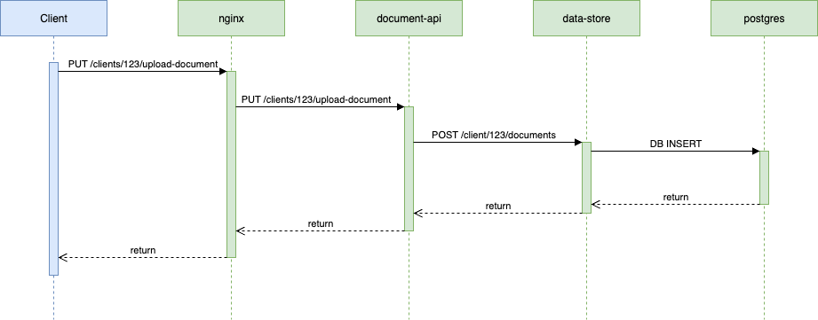

# Robin Interview - Document Storage System

## Instructions

Our engineers have built a new application stack for accepting and storing documents, one
of the features of this system is that it uses an LLM to summarise the documents on upload
(see `summarise_document_using_llm` function in [document-api/main.py](./document-api/main.py)).
For the purposes of this exercise the LLM response is faked.

They are looking for your help in adding observability to the project in a way that would
support deploying the application to production:

- They want to observability to help them troubleshoot issues when things go wrong
- They have added some helper methods to [./document-api/telemetry.py](./document-api/telemetry.py)
  for submitting metrics. Currently they have only added a counter to the healthcheck endpoint.
- The application will be deployed into some form of container orchestrator like ECS or K8S

They would like you to implement some observability focused additions to the project, they are not
looking for an exhaustive implementation for every facet of the project; they are looking for a
examples & patterns of observability features that you would recommend in a real project of
this structure which they can then apply everywhere.

The OTEL collector is included to receive data from the applications and represents a full
observability platform (such as DataDog) - we don't require any further UI tools here. The collector
is configured to log out any received metrics/traces/logs.

Show your workings via git commits. Don't spend more than 90 minutes on this.

Feel free to use AI assistants to help you complete this task, but avoid bashing the whole
task instructions into an LLM :). We want to understand what your thoughts and approaches are to
adding observability to an existing system.

Send your finished solution back to us along with any notes you would like to add, we will review it.
If we decide to proceed, we’ll use this solution as the context for follow up technical questions.

Tips:

- As a first step you may want to run the full stack and run the tests - this will show you how the otel
collector logs out the received metrics.
- The python applications are ran using uvicorn with the --reload flag, so any changes you make to the
  the python code will be reloaded and available instantly.
- This project requires docker to run the stack and tests

## Architecture

- **nginx**: Reverse proxy for the document-api service
- **document-api**: FastAPI service handling document uploads with client-based routing. Stores documents via the `data-store`
- **data-store**: FastAPI service managing document metadata in PostgreSQL with client isolation
- **postgres**: Database with client-based document isolation
- **otel-collector**: OpenTelemetry collector for distributed tracing (stdout output)



## Running the Project

```bash
# run all services
./setup-and-run.sh
```

## Testing

Use the included test project to verify the API after running `setup-and-run.sh`:

```bash
make test
```

## Development

Each service uses Python 3.13 with Poetry for dependency management.

## OpenTelemtry Integration

The `document-api` project contains the client side setup required for a python application
to connect to the OpenTelemetry collector running via compose, see `document-api/telemetry.py`.

The collector will log out any received metrics/traces/logs.

### Package Management

The python applications use poetry to manage dependencies. If you do not wish to install poetry
on your machine, you can interact with it via the services defined in the compose file.

For example, installing a dependency into the `document-api` project:

```bash
docker-compose run --rm document-api poetry add opentelemetry-api
```

## Services

- **nginx**: `http://localhost:80` (main API access)
- **document-api**: `http://localhost:8000` (direct access)
- **data-store**: `http://localhost:8001` (internal service)
- **postgres**: `localhost:5432`

## API Endpoints

### Document API (via nginx on port 80)

- `PUT /clients/{client_id}/upload-document` - Upload document for specific client
- `GET /clients/{client_id}/documents/{document_id}` - Retrieve document metadata
- `GET /health` - Health check

### Data Store API (internal port 8001)

- `POST /clients/{client_id}/documents` - Store document metadata
- `GET /clients/{client_id}/documents/{document_id}` - Get document metadata
- `GET /health` - Health check
